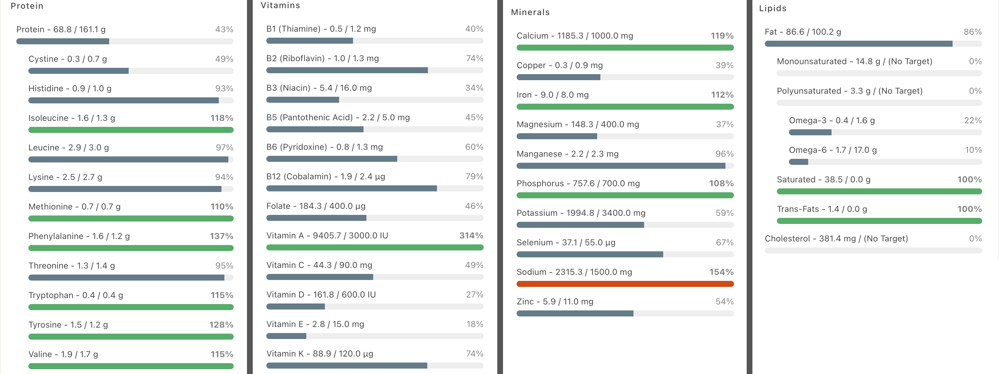

# Bites and Bits
### Gamifying nutrition: a rare non-political post

I recently got an ad for a multivitamin aimed at vegetarians. The concept seems sound: vegetarians like myself [have a harder time coming by certain nutrients like the B vitamins](https://www.mayoclinic.org/healthy-lifestyle/nutrition-and-healthy-eating/in-depth/vegetarian-diet/art-20046446). God knows how many times someone has asked me where in the heck I get my protein from without meat. Until now, I've always just shrugged. I've been entirely meat-free for over 16 years and I've never had trouble running, biking, or climbing. I haven't dropped dead, so surely I'm doing *alright*! When I started looking into multivitamins, however, I found a distinct lack of studies correlating them with wellbeing or even lowered morality. Unless you're seriously deficient, most studies conclude that multivitamins are, at best, harmless. The Mayo Clinic agrees, [stating that whole foods are usually a better source of nutrients than multivitamins](https://newsnetwork.mayoclinic.org/discussion/multivitamins-and-supplements-to-take-or-not-to-take/), and appear to be absorbed more efficiently and yield additional benefits.

This all begs the question... are we eating the right stuff? Coincidentally, my flatmate recently ordered a digital scale and I have no shortage of time, so I've resolved to log everything I eat or drink into a nutrient tracking app for the next week to get a clearer picture. The easy method is to log foods in bulk; entries in most nutritional databases exist for meals like "greek salad" or "pesto pasta". We can go even more granular than that, however! For anything unbranded like vegetables, the option exists to log ingredients down to the gram. It takes awhile to weigh everything as you cook, but hey, it's better than [doomscrolling](https://en.wikipedia.org/wiki/Doomscrolling) on Twitter.

I made no effort to eat differently than I usually do for this experiment. The app also sets a recommended daily value based on sex, height, weight, and level of activity. Anyway, here's my report card, measured down to the gram:

Overall, it's a mixed bag. For protein, I'm taking a good rounded mix. The bad news is in the quantity. My recommended 161g is going to be hard to come by naturally. Vitamins have a few deficiencies as well, most notably vitamins C, D, E and the B vitamins. Minerals are easier to come by but leave room for improvement. I'm certainly consuming *enough* fats, but not the right ones. My plan for improving this scorecard is fairly straightforward and doesn't require monumental changes to diet:

1. Reintroduction of cereals. I stopped buying cereals some years ago because I saw them as empty carbs. Of course, many breakfast cereals *are*, but others are fortified. Grape Nuts, the cereal your grandparents prefer, comes stocked with large doses of iron, folate (an artificial form of the B Vitamin folic acid), manganese, niacin, and more. The amounts are not insignificant either, a single bowl will satisfy 100% of your daily value of many of those minerals. When consumed with Vitamin A & D milk, it hits many of these targets.
2. The lofted bullet blender. A single smoothie can hit almost all the remaining targets in one go. My recipe involves 50g of baby spinach (you can never eat too much); a cup of greek yogurt, providing both 36g of protein and B vitamins; a tablespoon each of wheat germ and ground flax seed to fulfill the omega fatty acids; protein powder for, well, protein; a carrot for vitamin K (seriously, one is all you need); and a generous serving of mixed fruit for taste. I use an assorted frozen mix, thawed overnight in the fridge to facilitate blending.
3. More eggs, with mushrooms and bell peppers for the remaining B vitamins and Vitamin C. Compared even to citrus, bell peppers are a more potent ascorbic.

Thats it! These guidelines don't even need to be hit daily for an improvement, and they are completely out of the way before dinner. Check back in a week for a followup score.
---

### Mystery Music

In unrelated news, I stumbled upon [a new artist on Spotify](https://open.spotify.com/artist/5ZzXaAuivVXuQaHCaRuxlD?si=ACmMUE-EQOqPCYru0mFWvg) that I really liked. When I checked the name, all I was presented with was this:

`00110100 01010100`

Hmm. Who could it be? You probably knew this already, but it appears to be binary. Let's convert it...
`0    0    1    1    0    1    0    0         0    1    0    1    0    1    0    0 `
`2⁷   2⁶    2⁵   2⁴   2³   2²   2¹   2⁰        2⁷   2⁶    2⁵   2⁴   2³   2²   2¹   2⁰`
`0 +  0 +  32 + 16 + 0 +  4 +  0 +  0         0 + 64 +  0  + 16 + 0 +  4 +  0 +  0 `
`                  52                                          84               `

Taking a *wild* guess, this is probably encoded with [ASCII](https://en.wikipedia.org/wiki/Ascii), the a simple text encoding. Let me just consult my table for these two numbers, and we get...
`4 T`
Ah. I should have known. It well known trip-hop artist [Four Tet](https://en.wikipedia.org/wiki/Four_Tet)! For anyone listening along at home, my favorite bit is the end of track number five (0181 0005), and the transition into track number six (0181 0006). This isn't really a "secret" album, it's listed on [his Discogs entry](https://www.discogs.com/artist/3543-Four-Tet). Still, I thought it was a fun puzzle. For further incognito entertainment, check out Four Tet's [Wing Dings](https://open.spotify.com/artist/1TIbqr0x8HoKzKBNtNN8wf?si=mU8FoicbR32Etr4NjhmBTw) album.