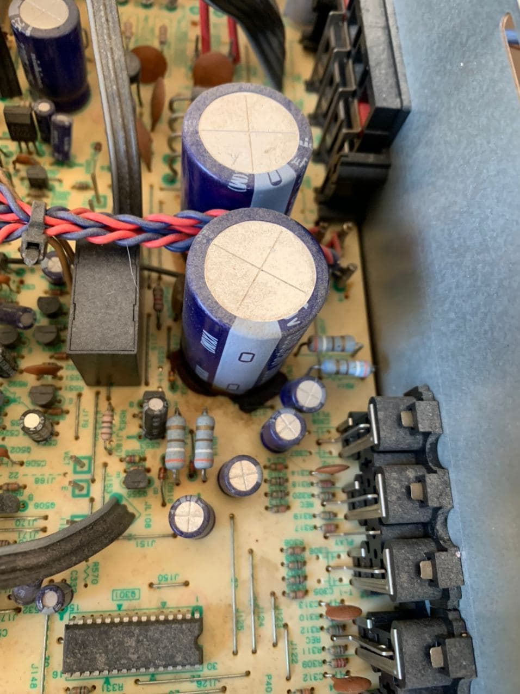
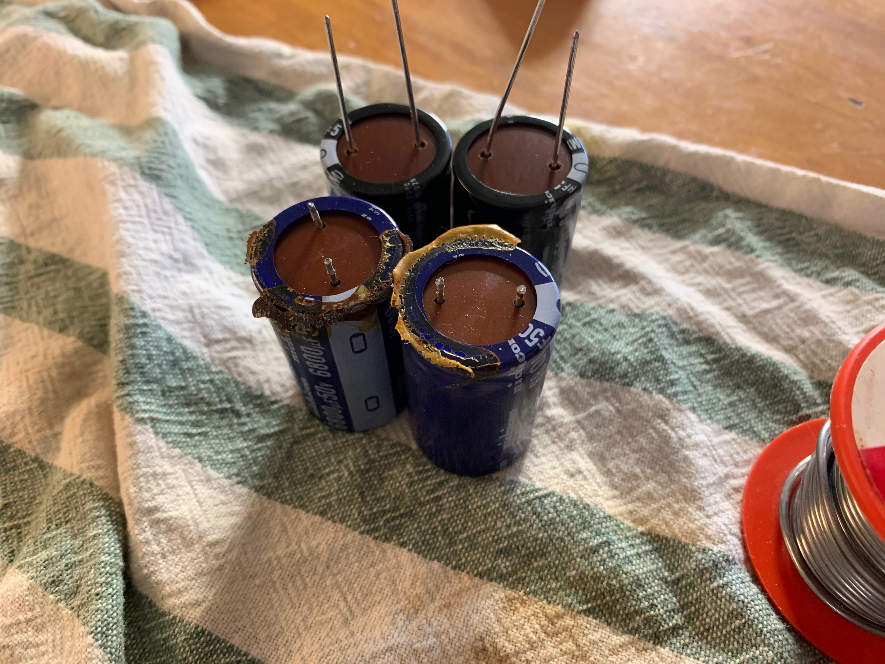
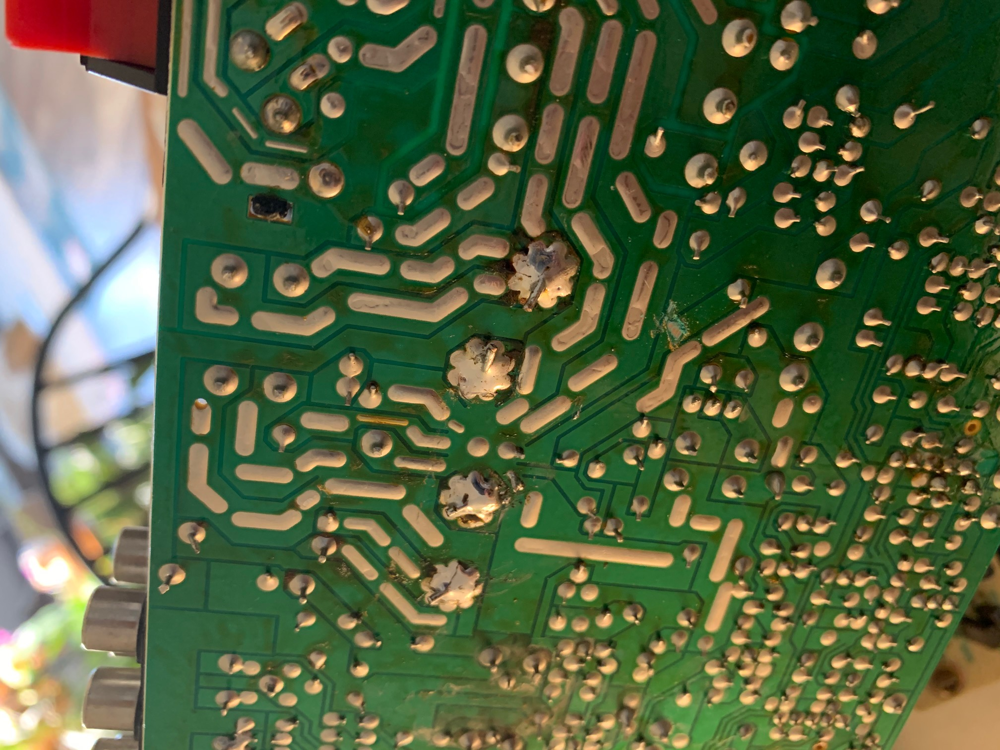
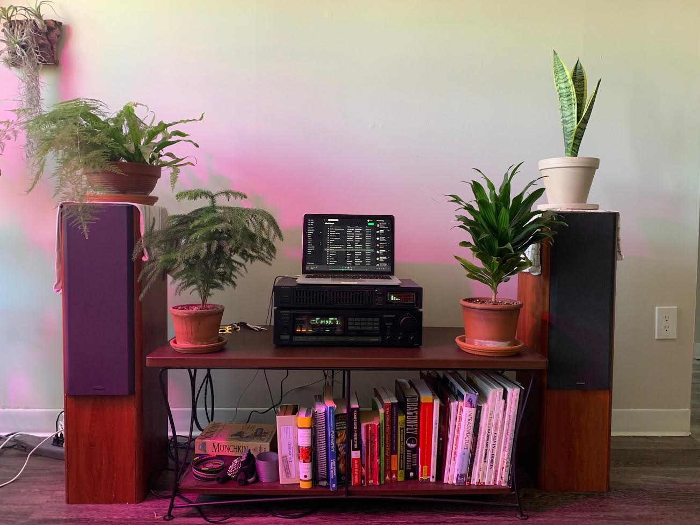

# Stereo Repair
Earlier this year I put together a budget stereo system. I bought a pair of Celestion F28 floor speakers, an Onkyo Tx-810 stereo, and an Onkyo EQ-25 equalizer. It really was budget; it all came from eBay, Craigslist, or a friend. I was pleased with it, and it worked great for awhile. However, a few weeks ago, it started crackling and popping. I ignored it at first, but it grew worse and worse. I tried all sorts of non-invasive troubleshooting steps like different outlets and inputs, but eventually I narrowed it down to hardware problem inside the stereo. I cracked the lid open and found the culprit right away: The two largest capacitors inside were leaking electrolytic fluid.

I'm no hardware expert, but this unit is old enough that the electrical components are relatively large, and the solder points looked approachable even to me. The first step was trying to find new capacitors: The manufacturer, Nichicon, no longer makes the model VX(M) caps. However, I was able to find an upgrade sheet showing the upgrade path. Even better, the replacement VR(M) capacitors are $1.50 on [Digikey](https://www.digikey.com/). For that price it seemed worth a shot.

This yielded mixed results. The output is not perfectly clean, but hey... the box is 25 years old. It is a huge improvement so far, so we'll see if my fix holds, or if the busted capacitors were a symptom rather than a cause.

# Book Roundup
I was able to finish up a few titles I had been putting off this week:
- [*A Brief History of Time*](https://en.wikipedia.org/wiki/A_Brief_History_of_Time) by Stephen Hawking; This recapping of modern [cosmology](https://en.wikipedia.org/wiki/Cosmology) is probably a little out of date, but is still seems like a good primer. It's a whirlwind tour of physics from a geocentric model, to the expanding universe, to string theory and beyond. I'm not sure how much I actually absorbed, and it's still difficult to really picture what a multiverse or curved spacetime really *means*, but nonetheless it's fun to think about.
- [*Children of God*](https://en.wikipedia.org/wiki/Children_of_God) (Sequel to *The Sparrow*); I read the first in this series awhile ago and really enjoyed it. The protagonist, a priest, has everything violently taken from him. The end of *The Sparrow* leaves him broken in many ways, but at least functional. This sequel drags the priest back to the planet where he was tortured and tries to provide a reason for his suffering; it's unapologetically spiritual by completing his arc from faith to atheism and back to faith. I appreciated the world building and character development, but the [defense of problem of evil](https://en.wikipedia.org/wiki/Theodicy) fell flat to me, and I found I enjoyed the first two thirds of the series more than the end. Maybe I'm just cynical.