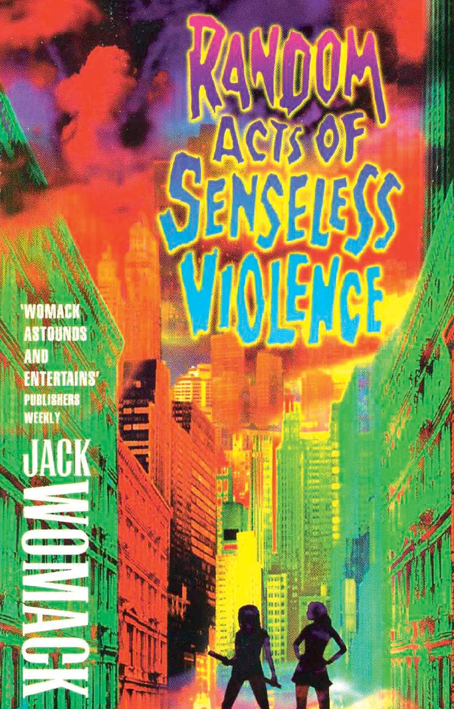
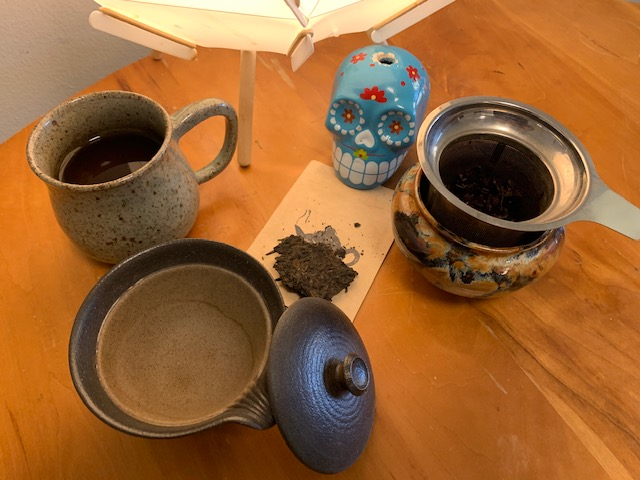

# february media roundup (and pu'erh tea)

### the expanse
My first three novels of 2021 were all part of [The Expanse series](https://en.wikipedia.org/wiki/The_Expanse_(novel_series&rpar;) by written by two guys under the singular pseudonym James S.A. Corey. The series is also now airing as a big-budget TV series under the  studios banner. It's set in a delicate political triumvirate with the United Nations of Earth, the militaristic Martian republic, and a scattered radical asteroid belt squirming under the heel of inner-planet oppressors. The original worldbuilding was planned to be the backstory of an [MMORPG](https://en.wikipedia.org/wiki/Massively_multiplayer_online_role-playing_game), and it shows through a somewhat pulpy atmosphere in the book series. That said, the series is painstakingly careful in staying true to hard sci-fi principals. The only magic handwaving comes from a novel mass-reaction drive enabling more efficient engines in space, but it doesn't neglect the other realities of space travel. Time delay in talking over distances is significant, gravity comes from thrust, and rapid accelerations have consequences on crew. The TV adaptation suffers somewhat from novice acting, but improves over time and stays faithful to the book series. Small tweaks make the TV series more concurrent and select characters are folded into each other, but it is still one of the closest adaptations I've ever seen. I recommend both the books and the show to anyone excited by the space opera genre.

### random acts of senseless violence
This is a novel by author Jack Womack about poverty and told through a young protagonist's diary entries. The family starts out just scraping by on the edge of upper class life and chronicles their descent as the US economy tanks from internal strife. An increasingly hostile New York City can't support them as they start to plinko down the social strata. The protagonist and her sister both learn their first lessons on the street as they are forced out of their cushy upscale home to a dingy apartment in a significantly worse neighborhood. Some salient points are addressed through these realities; poverty demands a constant energy expenditure of their increasingly tired parents, public transit simultaneously becomes a crucial lifeline and a debilitating time-sucking handicap. It reminded me of Kafka's *Metamorphosis* in a way; from our perspective the characters suffer from externalities, but to calloused outsiders they have become tainted by poverty. The novel also grapples with the complexities of being queer in such a hostile environment. This is an easy novel to recommend partially because the narrative is so straightforward. I needed to know how it ended, but from early on the tone is set and it's clear this is not going to be a story of miracles. Brace yourself for, well, senseless violence.

### pu'erh tea
This is a [genre of tea](https://en.wikipedia.org/wiki/Pu'er_tea) I've been avoiding for some time because my brews have never turned out well. Most tea I've always been able to at least appreciate, whether that be white, green, black, or my personal favorite, oolong. These other types of tea all exist on the same spectrum of unoxidized to oxidized, but pu'erh brings a new dimension: fermentation. Some of my troubles boil (heh) down to quality. Cheap pu'erh isn't stored correctly, and can carry a fishy smell making for relatively unpleasant brews. It's also different in form, as it comes in compressed bricks rather than loose leaves. I've ordered and tried a few samples, but I've never gotten a good cup out until now. I've just discovered that this was due to a bad brewing technique. Many teas are very straightforward and list a brewing temperature and time that stays relatively consistent regardless of methodology. Again, pu'erh is different here. 
- My first mistake was skipping the wash cycle. This may sound strange, but the first brew with these leaves is best tossed out. It contains dust and detritus from the long storage the tea undergoes before and during fermentation. Thus my first steep is now about 20 seconds long, and I discard this liquor afterwards.
- My second mistake was using too few leaves. Many teas benefit from ample room to unfold (and thus a lower leaf/water ratio), but pu'erh's strong flavors are all washed away in that first rinse. This is corrected by increasing the amount of leaves used in the brew.
- My last mistake was steeping for times comparable with my standard fare of green teas, centered around three minutes. Extractions of this length will end up rather bitter, and the best flavor I've brewed came from a steep lasting only five seconds!

It is often made in a [gaiwan](https://en.wikipedia.org/wiki/Gaiwan) - the small lidded, ceramic dish shown above, but I've adapted the technique to work with my preferred metal brew basket. The result of the improved brewing method is a beautiful spectrum of liquors ranging from dark amber to ruby red. It is light on the nose, and carries both sweet and savoury flavors. I was convinced for awhile that this tea is strictly an acquired taste, but now I believe anyone can enjoy a well-made cup.